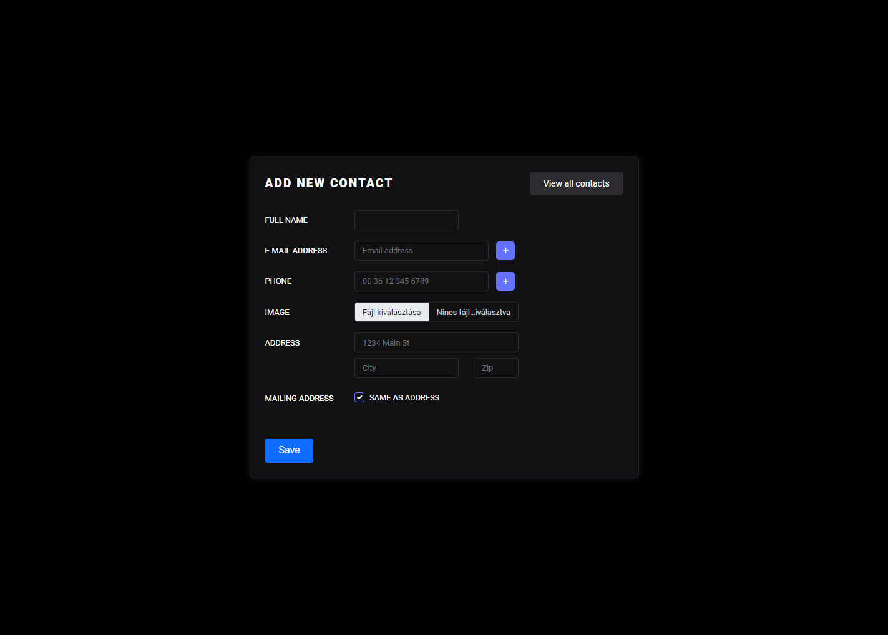

# Netipar Trial task
This repository contains a trial task for the netipar company, using these stacks:
- Laravel 9
- Bootstrap 5

#

### The task is to create a phonebook with the features below
- Create a name
- Can add an unlimited e-mail address (1 e-mail address can only be included in the system, it must be filled in)
- Unlimited number of phone numbers can be attached (optional)
- Can attach a photo
- Can enter a home address and mailing address. (If the same, you only need to fill it once)

#

### Phonebook contact list

### Create a new contact

### Created contact

### Edit a contact

### Confirm deleting a contact

### Deleted contact

